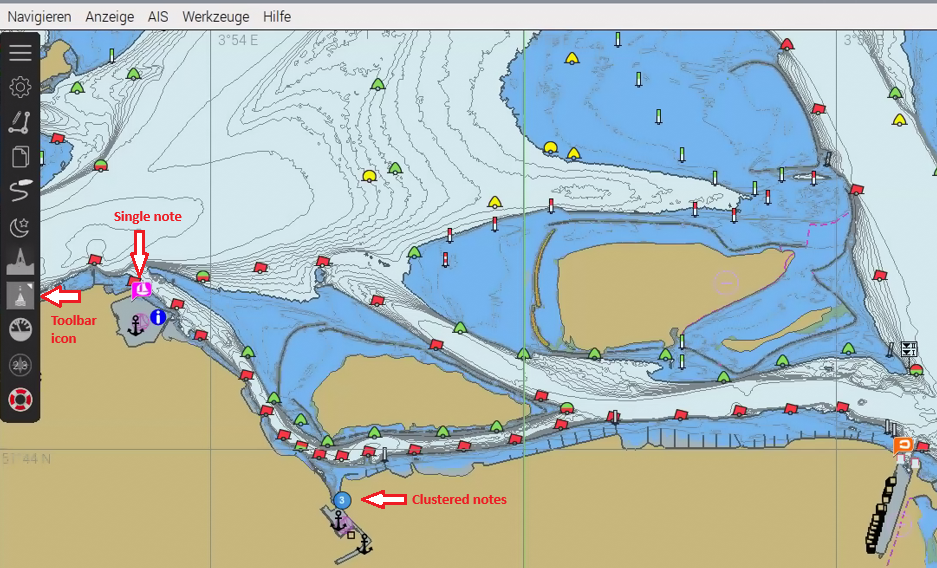
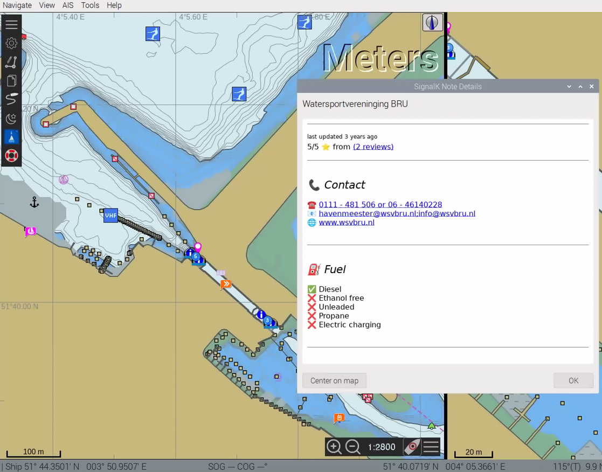
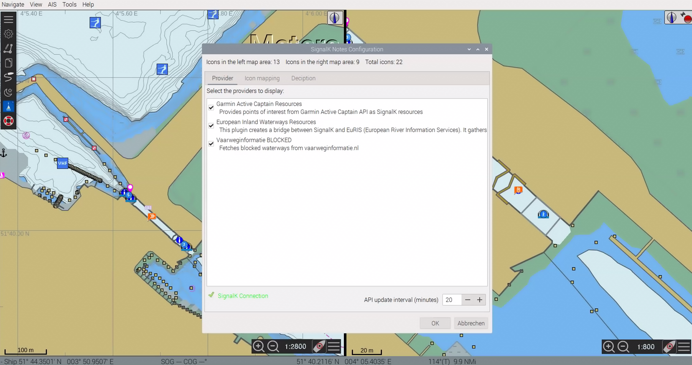
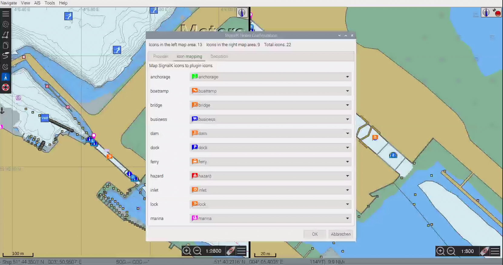
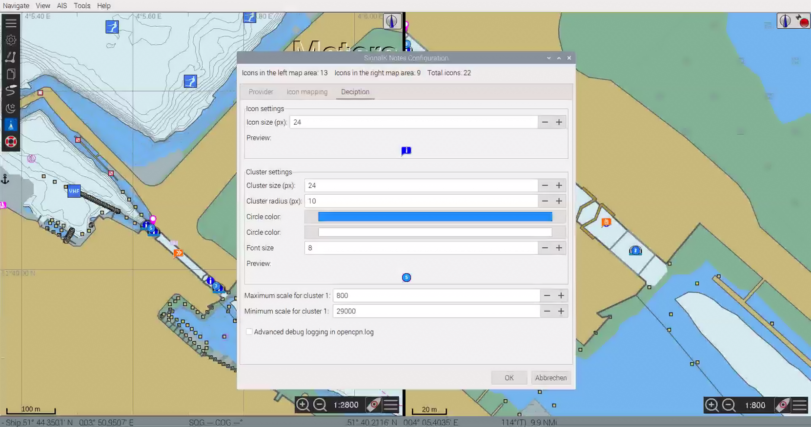

# SignalK Notes Plugin for OpenCPN

The **SignalK Notes Plugin** enhances OpenCPN by displaying **notes stored on a SignalK server directly on the nautical chart**. It is especially useful in setups where SignalK already acts as the central data hub.

The plugin shows notes as icons on the chart and updates them automatically whenever data on the SignalK server changes.

If there are too many notes in one place, they will be clustered (shown as a circle with the number of notes) and will only become visible at a smaller scale.

Several SignalK plugins (like ['Garmin Active Captain Resources'](https://activecaptain.garmin.com/en-US/map) or ['EuRIS (European River Information Services)'](https://www.eurisportal.eu/)) create notes and with this enhanced information for the skipper.

## Features

### • Display SignalK Notes on the Chart
The plugin reads notes from the SignalK and displays them as icons at their respective positions on the map.

### • Automatic Updates
New or modified notes are detected automatically and refreshed on the chart.

### • Selectable SignalK Providers
If multiple SignalK data sources (providers) are available, you can choose which ones the plugin should use.

### • Customizable Icons
Each note type can be assigned its own icon. Icon mappings can be configured in the settings dialog.

### • SignalK Authentication Support
The plugin supports authentication for SignalK servers that require login credentials. The current authentication status is shown in the settings dialog.

## Configuration

Open the settings dialog via the toolbar or via

**OpenCPN → Options → Plugins → SignalK Notes → Preferences**

The dialog includes the following sections:

### 1. SignalK Authentication

Authentication in SignalK is not mandatory. If it is present: 1. Provider will be automatically deleted if the plugin has been deleted in SignalK or is no longer active 2. The name of the plugin and the description will be displayed instead of the plugin ID.

The request for authentication is made via the “SignalK authentication” button on the “Provider” tab.

The request should be approved in SignalK in the menu Security → Access requests with 'Permission' Admin and 'Authentication Timeout' NEVER

As soon as the request has been approved the valid connection is displayed in SignalK in the menu Security → Devices (with description 'OpenCPN SignalK Notes Plugin') and in the plugin on the tab "Provider".

### 2. Provider Selection
- List of discovered SignalK providers  
- Enable or disable individual sources / provider

### 3. Icon Mapping
- Assign icons to specific note types  
- Choose from the included icon set  

### 4. Display Settings and debug log
- Adjust icon size for single notes  
- Adjust icon size, colour, font for cluster symbol
- Detailed debug logging for the plugin in the opencpn.log file is possible via the checkbox. However, this should only be activated temporarily if there are real problems with the plugin.
- 

## Installation

The plugin can be installed like any other OpenCPN plugin:

1. Through the OpenCPN plugin manager  
2. Or by compiling from source  
3. After installation, a new toolbar button will appear  

## License

This plugin is released under the **GNU General Public License, Version 2 (GPLv2)**.  
You may use, modify, and redistribute the plugin under the terms of this license.

### Included Icon Licenses

The plugin contains icons from two external sources. Their licenses require attribution:

#### freeboard-sk Icons (Apache License 2.0)

Some icons included in this plugin originate from the [*freeboard-sk*](https://github.com/SignalK/freeboard-sk) project.  
They are licensed under the **Apache License 2.0**, which permits use, modification, and redistribution as long as attribution is preserved.

#### OpenCPN Standard Icons (GPLv2)

Some icons are based on or derived from OpenCPN’s standard icon set, which is licensed under **GPLv2**.

### License Compatibility

Because GPLv2 is the stricter license, it governs the overall plugin.  
All included assets are compatible with GPLv2, and the plugin complies with the redistribution requirements of both licenses.
